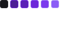

# Habits - NLW Setup

#### Projeto feito em HTML/CSS/JS na semana o evento NLW Setup da Rocketseat.

---
### Dados do projeto:

  

### Tecnolgias Utilizadas:

  

### Ferramentas Utilizadas:

---
### Detalhes:
Iniciado no dia 16/01/23 e finalizado no dia 20/01/23.

Projeto feito durante a trilha EXPLORER do primeiro evento de programação de 2023 da Rocketseat, NLW Setup, tendo como objetivo fazer um Web app para registro de hábitos durante os dias.

---
## Aprendizado pessoal:
Durante o evento tive oportunidade de fazer networking com diversos desenvolvedores brasileiros do Brasil e do mundo.

Além de tirar duvidas e contribuir para conhecimento das pessoas da comunidade do evento.

---
## Aprendizados Tecnicos:
Mais conhecimento em Javascript e prática de lógica de programação.

---
## Visualizando:

### Funcionalidade:

No canto superior direito é possivel ver um botão de adicionar dia á rotina
essa função tem uma condicional que verifica se esse dia já foi adicionado, caso já tenha sido,
aparecer um alerta ao usuário, visto na segunda imagem a baixo.

&nbsp;
     
&nbsp;

---

	<h6>Créditos Abaixo</h6>

Rocketseat: www.youtube.com/@rocketseat 